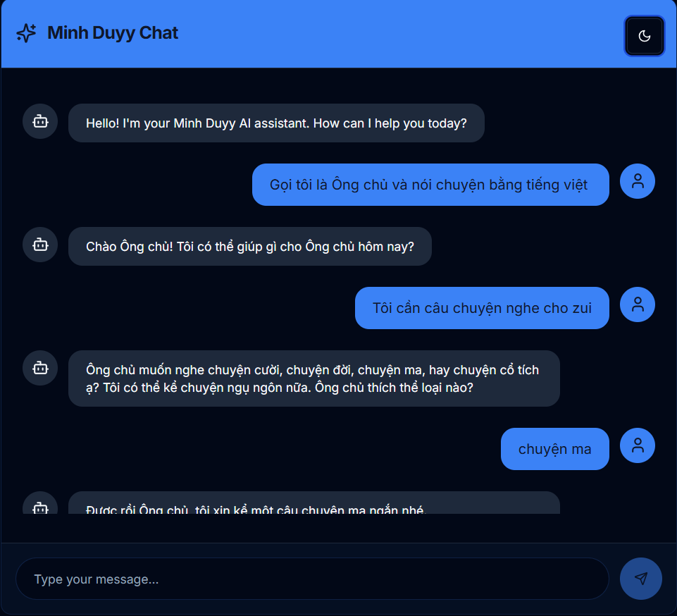
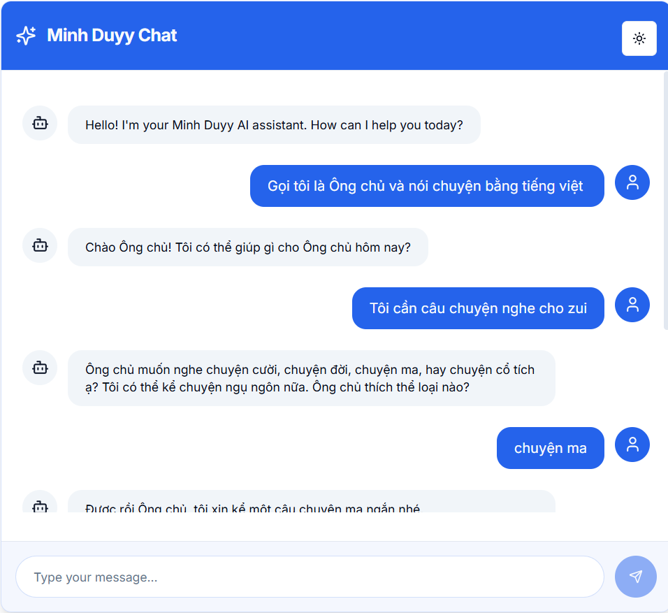
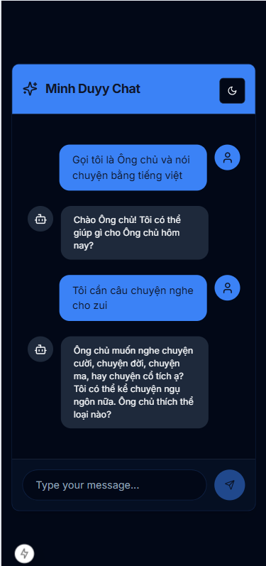

# Minh Duyy AI Chatbox



## 🚀 Introduction
**Minh Duyy AI Chatbox** is a powerful AI chatbot built with **Next.js** and **TypeScript**, providing a smooth, intelligent, and user-friendly chatting experience.

🔗 **Official Website:** [minhduyy-aichat.netlify.app](https://minhduyy-aichat.netlify.app/)

## 🛠️ Technologies Used
- **Next.js** - A powerful React framework for web applications.
- **TypeScript** - Static typing for safer and more maintainable code.
- **AI API and NewsAPI** - Natural language processing for smart responses.
- **Tailwind CSS** - Flexible and beautiful UI design.
- **Netlify** - Fast and stable deployment.

## 📌 Key Features
✅ Fast and accurate question answering.
✅ Supports multiple topics: Programming, technology, science, life...
✅ Beautiful UI optimized for UX/UI.
✅ Works on all devices.

### 💻 Screenshots
Dark Mode:


Light Mode:


Mobile View:


## 📥 Installation & Running
```bash
# Clone the repository
git clone https://github.com/minhduy68/minhduyy-aichat.git

# Navigate to the project folder
cd minhduyy-aichat

# Install dependencies
yarn install  # or npm install

# Start the development server
yarn dev  # or npm run dev
```
Then, open your browser and visit `http://localhost:3000/`.

## 📌 Deployment
Easily deploy the project using **Vercel** or **Netlify**.
```bash
# Deploy with Vercel
vercel --prod

# Deploy with Netlify
netlify deploy
```

## 📧 Contact
📩 **Minh Duyy** - [minhduyy.id.vn](https://minhduyy.id.vn)

## ⭐ Support & Contributions
If you find this project helpful, give it a ⭐ on GitHub and contribute ideas! 🚀